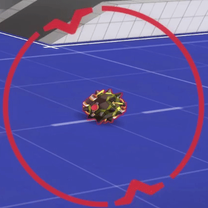
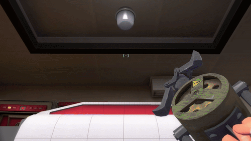
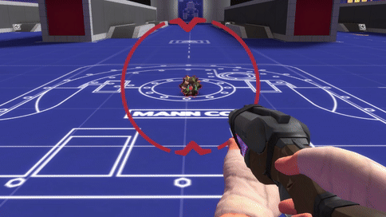

# MvM-Passtime-Support
Re-Made Fundamental Aspects Of The Passtime_Ball Entity with VScript To Allow It To Function In MvM Missions  
  
  
  

# Bugs / ToDo  
Script Is Still Experimental, Not Final Version.    
.Disconnecting While Holding The Ball Breaks Everything.  
.Reseting The Wave While The Ball Is Being Held Does Not Remove Thinks As Intended.   
.There Is No Check to Prevent Bots From Picking Up The Bomb.  
.Code Structure Is Messy And Full Of Placeholder Names.  

# How To Use
Simply add, via Hammer, PointTemplates(Rafmod) Or VScript, An "info_passtime_ball_spawn" To The Map.  

The Info_Passtime_Ball_Spawn Requires 3 KeyValues:  
. A Targetname of "ipbsspawn"  (suffixes Are Supported If You Need Multiple Ball Spawns. (Only Ever Have One Active At A Time)  
. A TeamNum Of 2 or 3 (For The Respective Team)  
. An Origin  (For best results, place at a height of 60HU off the ground and above a flat surface.)  
 
Load the VScript like you would any other VScript With:  `InitWaveOutput`    
 *Only Place In One Wave.  
 
To Actually Spawn The Ball, Use: `InitiateSpawn()`  

Functions Can Be Called With DoEntFire Or I/O     
EG. `DoEntFire(``worldspawn``, ``RunScriptCode``, ``InitiateSpawn()``, 0, null, null)`  
EG. `"OnSTartTouch#1" : "!activatorCallScriptFunctionInitiateSpawn-1-1"`  

# Important Functions  
====Vital=====  
--- `InitiateSpawn()` ---  
: Call This To Spawn The Bomb

--- `PTBHitTarget()` ---     
: Call This To Detonate The Bomb And Respawn It.    

--- `RespawnPTBomb()` ---  
: Same As Above But Dosent Cause The Bomb To Explode.

  ====In Case You Need It====  
--- `dropptbomb(false)` ---   
: Call This With The (false) Param To Cause Holder To Drop The Ball.    

--- `dropptbomb(true)` ---   
: Call This With The (True) Param To Cause Holder To Throw The Ball.    
